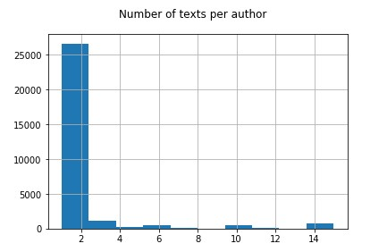
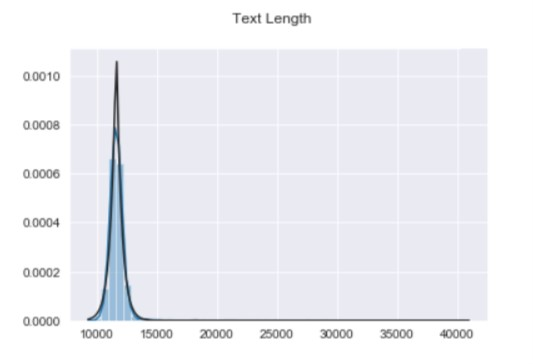
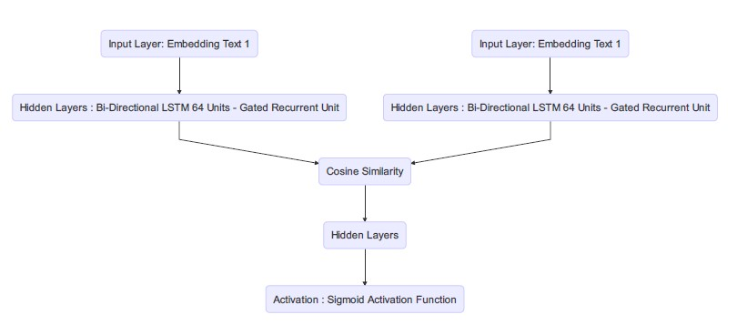
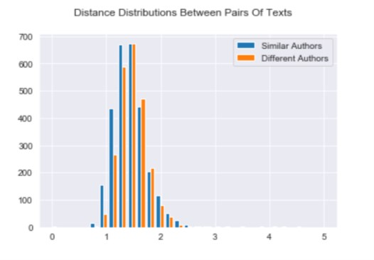
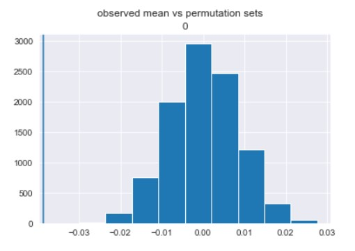
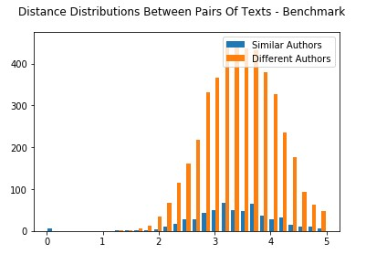
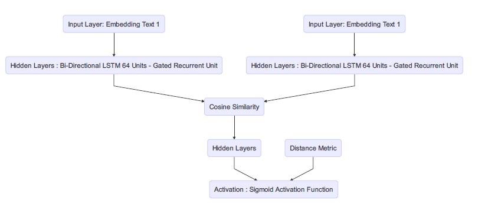
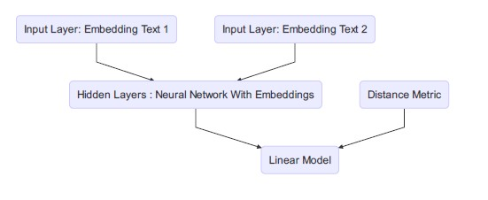
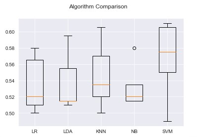

<!-- see Figure \@ref(fig:example1) -->
<!-- ```{r example1, fig.cap="Examople"} -->
<!-- hist(cars$speed) -->
<!-- ``` -->


```{r setup, include=FALSE} 
knitr::opts_chunk$set(warning = FALSE, message = FALSE)
```

# Introduction

This project is in fact an experimental continuation of an initial paper that was presented $^{(1)}$ "Domain-based Latent Personal Analysis and its use for impersonation detection in social media" . In this paper we will explore the additional experiments of the Latent Personal Analysis (LPA) and its application within the Machine Learning modeling environment.

In the initial paper (Mokryn 2020) ,Mokryn presented a new method of characterization of entities in a textual (or also non textual) domain, finding domain based attributes to explain authorship attributions. The paper discusses a new approach to defining a signature for authors using both the emphasis on which words were used and over used, but in addition also the missing popular words.

As part of the previous experiments two methods were tested - two types of impersonations: (1) authors with multiple accounts (sockpuppets) , (2) font-user accounts - accounts with multiple authors.

In this paper we will explore this attribution in a classification representation and learning environment. We will explore a classification model inspired by the Neural Network of textual data (Siamese Recurrent Architectures) we will explore whether the addition of the attributes based on the LPA can contribute to the performance of a model vs the classic method of an RNN based model. This will be tested under a set of experiments which may include different setups of the data corpus and different architectures of the classification model.  We will discuss in what terms can the signature and its distance from another signature (LPA distance) contribute and whether there may be a domain based limitation to this. 


Another paper that is worth noting with similar work regarding text similarity worked with the Manhattan LSTM Model. This model was built by Mueller to compare similarity between two texts in terms of semantics, and although the problem we are trying to solve is different (semantics vs style), we can be inspired by its architecture to understand potential caveats and insights, as well as understand the method of cmomparison between texts can be applied. \cite{Mueller}


## LPA

The LPA distance is a distance between frequency vectors , where we emphasize not only on the the term frequency that was used, but also the terms that were not used, or how much less they were used. ( As opposed to the TF-IDF). 
What Mokryn has expressed and explored was using this distance we can identify how different two articles are relative to the difference of the main corpus. In other words, looking at the general term usage of all authors together , we saw that the distance is usually lower between two signatures of the same author. We cosider the signature of an author as the LPA vector of frequencies.
So we say that two texts are similar in terms of "style" if their distance between the signatures is small, and the opposite for large distances. We also take from Mokryns paper that authors that have multipple texts tend to have smaller distances between the texts vs between another random text , which indicates that an author has some consistency accross all texts in terms of style.

The DVR: The domain vector is considered a weigthed collection vector which aggregates all the domain entities. The weight is the relative frequency out of all domain words.

To calculate the LPA distance we use the Kullback - Leibler Divergence (KLD) with a back-off  (Kullback and Leibler 1951). This is calculated by 

$$
D([V_1, V_2]) = \sum_{x\in X}\left[(v_1(x) - v_2(x))\log\left(\frac{V_1(x)}{V_2(x)}\right)\right]
$$
This was accepted in the 2021 paper after considering several different distance metrics such as RBD, cosine similarity and L1 norm.

To create the PVR we saw that $_{(8)}$ we will look at the top 500 terms due to sparsity of the single texts signature. (the head of the vector) We noticed in the previous paper that due to sparsity we have issues with zero valued elements which resulted in a variation of $KLD_{\epsilon}$ which adds an $\epsilon$ to the zero based values within the vector (Bigi 2003)  

$$
V_{\epsilon}(t_k || d_j) = \begin{cases}
    \beta V_1(t_k || d_j) & t_k \in d_j\\
    \epsilon,              & \text{otherwise}
\end{cases}
$$

Where $\beta = 1 - N_{\epsilon}$ where N is the number words missing in one vector compared to the other. and $d_j$ is the original domain vector. (Bigi 2003)


## The Data

The data that was chosen in this paper is "PAN20 Authorship Analysis: Authorship Verification" dataset. This is a well known dataset which was created to explore the different approaches  of authorship verification, meaning whether we can detect two texts that an author wrote based on their writing "style" \cite{Bischoff} .

The initial dataset contains 52601 sets of pairs of texts. Each pair has its label of whether the two texts were from the same author or not. In addition we have the indicator of the id of which author it does indeed belong to.

For the sake of this analysis I will conduct a small exploratory analysis on the paretos of the authors to understand the weights of the distribution per author in our universe of texts.

There are 52655 unique authours within the data corpus.  The author with the most articles pertains 15.  This is important since we can nearly eliminate any bias that may occur to our upcoming model due to prior distributions of the data regarding the "memory" of a specific author.
Below we can view the histogram of the texts per author.



This will also aid us in terms of the assumption that each row in the dataset which contains two texts of two authors is independent from any other row.

In order to use this data I will need to perform a bit of cleaning. The initial cleaning step would be to remove all stopwords as well as stemming the words using a traditional NLTK stopword remover and stemmer. This is acceptable by both methods (LPA analysis and word embedding NNs) and is essential to perform the analysis. 


The second step which will be the main process for the second phase of the experiment is to build the domain vector of frequencies for the LPA. 

To optimize computation I will conduct a small experiment where I trim the sentences to a limit of 100/500/1000/2000 words , to accelerate the computation. One assumption I will be taking here is that this size is large enough to represent the larger distribution of the texts' domain and will result in significant enough results. I take this assumption due to Mokryns proof that this model of LPA applies on social media as well which by dfinition has a smaller amount of elements in the text (Twitter etc.).

below we can view the distribution plot of the text lengths and conclude that 75% of the texts have between [10k. 13k] words within the texts. 



Lets view the text length per author. We can see the distribution plot below that as the mean length per author rounds at about 15k with a long tail of outliers . This issue will be reduced once the data is in a standard format of the first N words to remove bias towards a specific length which the model might learn and create the assosiation rather than the actual style of the text. One can argue that the length might be an attribute of the the style , though for the sake of this experiment we will remove it to emphasize the word usage rather than text length. (Note that an example that may occur is authors that tend to write childrens books may write shorter texts vs authors that tend to write adult books.)


# Setup

## Terminology 

We will name the corpus of word frequencies as the Domain. This will be a vector of unique words and their frequencies across all texts in the domain. The authors will be the categories. The signature of each text is the vector of the KL distances (frequencies).

The articles are the texts which are given within the dataset. Each row within the dataset holds two articles , one per each author (possibly same author).

The term "Sockpuppets" refer to users which write texts from different aliases , though their style compared to the DVR is still unique and the distance would be smaller between each two signatures rather than two random signatures.


## Benchmark

For the benchmark of this experiment I will create a classifier which will be based on a pre-trained GloVe embedding. The pre trained embedding is considered a standard approach using the embedding trained on Wikipedia's word corpus \cite{GloVe} - GloVe 6B with a dimension of 50.
The model will be treated as the traditional NLP approach using a neural network the will recieve the two texts and return a prediction of whether the texts are originated from the same author.

The metrics that we will observe here are accuracy , presicion , recall and F1 score. I will address the AUC score and ROC curve as well . 
We can initially discuss accuracy as the main metric since our data is not heavily imbalanced (53:47), though observing the other metrics as well will give us a more robust benchmark and more conclusive overview of the current situation.


## Assumptions

We need to state a few assumption on the data prior to the analysis. First we need to state that the different authors are all writing about the same sub domain which is science fiction. This may not resolve in a change, though may need to be tested on different corpus going forward for confimation. I will address this later in the paper. This may also cause a bit of issues regarding the classification because the domain is a somewhat closed set which involves the same terminology across the signatures. Therefor we may experience a decrease in the performance compared to wider spoken domains.

The texts length may play a part as well. We are viewing texts that are considered long compared to other papers which viewed social media which tends to have shorter texts than the ones we are dealing with here. The signatures may seem sparse compared to the domain vector, as the domain pertains more texts from various users. We will assume that the head of a text, meaning the first N words of the text may capture the signature of the author and its text . Our N will vary between 100-2000 using the assumption from Mokryns paper that the LPA will be applicable on social media which tends to have small texts lengths such as the above.


# Experiments

For the sake of the experiment I will split the data into three. I will intially split the data into 80:20 randomly as use the 20% as my "out of sample" set. Next , I will split the remaining into 80:20 for my train-test to train the model. For the sake of computational limitations I randomly sampled 5000 articles for this analysis. (using the python random generaotr to reduce sample bias)

These three sets will be the same for all methods of the experiment and the comparison will always be on the same groups between the methods. Later I will re-shuffle / cross-validate the method to compare within the models performance .

To test this methodology fully, I will conduct several experiments. (1) on textual corpus of 100 words - trimmed (2) on 500 words (3) 2000 words. Ideally We would like to see whether the LPA addition improves the prediction in different sizes of texts and test its robustness.


## Method 1 - Embedding Network


In this method as stated above, I will implement a supervised classifier with a neural network architecture . The model will hold an embedding layer as its initial layer and based on the lower dimensional representation ,it will conduct the continued flow within the neural network to perform the prediction.

This model will recieve as an input two texts and provide a prediction in a binary matter. Mentioning other work done in the matter, I will state the terminology of the form of the model as a Siamese RNN. 
In this paper \cite{Siamese} we are introduced to the architecture of multiple parallel embedding networks merging into one linear network pipe. This has been proven to be an acceptible architechture which will be based as our benchmark to be compared to. Each one of the parrallel networks will be a Bi Directional LSTM with an embedding layer. As proven in previous work, the LSTM serves as a great classifier due to its memory effect within sequential data (updates within the hidden state). Within our corpus we will be treating the single texts per author as the sequences , and once we represent within a tensor formation, we will run the formal comparison within the network. The action which will take place in order to merge these two tensors together with relation to each other is by performing a dot product between tensors. This similarity is an approximation to the cosine similarity. Sitikhu (Sitikhu 2019) presents in his paper that the cosine similarity using word embedding works quite well, and we will try to apply this on our network.\cite{Sitikhu} 
Therefor we will use the cosine similarity as the following:

$$
similarity = cos(\theta) = \frac{A \dot B}{\|A\|\|B\|}
$$

Our final classification function will be based on a sigmoid logistic function to resemble our probability of similarity.
\cite{Neculoiu}

$$
sigmoid=\sigma (x) = \frac{1}{1+e^{-x}}
$$

It is worth noting that within the Article-Level LSTM we see that a 62% accuracy has been reached for a 50 dimension dataset (C50) . Though as we see there is a different behaviour to the data and possibly a wider variance to the dialect and style causing it to possibly be easier to distinct.  Also , In this previous paper there has been a limitation that the analysis was on a sentense basis meaning there was a sentence represented an averaging of word vectors, where here we represented the vector as an entire article. 
It is also worth noting the sample of authors being trained on, where in this case we have a more difficult problem, and therefor would expect a slightly lower accuracy. 

For the first step here I will lower case all words and remove stopwords .Then tokenize all texts' words and define a padding sequence that will be of the different lengths according to the test [100,500,1000, 2000] . This will give us the flexibility to look at the entire text rather than trim it. 

The next step would be to create the embedding matrix based on GloVe's embedding index. This will be the input to our first layer within the network.
I will initialize the weights of the LSTM randomly.


Once merging both networks, I will conduct a concatenation (perform the cosine similarity) between the tensors as the first step of the mutual architecture.


```{r echo=FALSE,  results = "asis", fig.align='center'}
library(gt) 
library("DiagrammeR")

library(DiagrammeRsvg)
library(magrittr)
library(rsvg)

# A minimal plot
# Define some sample data
library(DiagrammeR)


# mermaid("graph TD
#           X1(Input Layer: Embedding Text 1)-->Z1(Z2)
#           X2(Input Layer: Embedding Text 1)-->Z2(Z2)
#           Z1(Hidden Layers : Bi-Directional LSTM 64 Units - Gated Recurrent Unit)-->Y(Y)
#           Z2(Hidden Layers : Bi-Directional LSTM 64 Units - Gated Recurrent Unit)-->Y(Y)
#           Y(Cosine Similarity)-->H(Hidden Layers)
#           H(Hidden Layers) -->F(Activation : Sigmoid Activation Function)
#         ")

```



As stated above, the model will recieve two inputs which will be converted to two embeddings. Each embedding will run through its own LSTM and concatentate into a single network. 

For the first network we will state the benchmark to be 51% accuracy on average. The training + out of sample validation run on different seeds resulted on an average of 51% accuracy, balanced with both precision and recall of 0.51. It is worth noting that also the F1 score resulted by definition as 51%.

We have run this model on different lengths of texts from 100-500-1000-2000 words. The full results will be stated below.


### Model 2 - Embedding & LPA

$\textbf{ Step 1: Build DVR + LPA Metric matrix}$

The next step is to include and incorporate the LPA distance metric between vectors. 
The first step is building a word-frequency vector per document, once we have this vector we can build our DVR. The DVR is the general domain of the corpus, which in this case is of the 10K articles that were chosen. The DVR is considered the "benchmark" to which we will be calculating the LPA metric. The process is including all texts in one , pooling all usages together 
The calculation is quite straight forward as 

$$
DVR(i) = \frac{f_i}{\sum_{j \in N}f_j}
$$

Where $f_i$ relates to sum of frequencies across all articles per a specific element.

Once the DVR is created \cite{OssiGit}, the next step is creating the signature per each text. This is of course with respect to the DVR . The PVR is created in the same matter as the DVR, only within a local environment and not pooled. (meaning pure frequency rate per article) .  


Following this step , we create the distance metric between each two texts. In our case we are looking at ~5K articles resulting in a distance matrix of 5K x 5K. this will serve as our dictionary which we will isolate the pairs which we will need for our training and validation sets.

### Exploration of LPA distances


### Differentiation between the two sets

Lets discuss the distribution of distances between the two sets of pairs. Lets remeber that we have close to half the dataset as pairs of texts written by the same author, and the other is not written by the same author. Our assumption based on Mokryns proposal is that the distance between similar texts should be lower than pairs that arent. Below we have the figures of the two distributions of distances grouped by whether the pairs are originated by the same author or not.




At first lets notice that the mean distances for each sample is (1.7 , 1.62) and std = (0.32,0.299)

Since we have a large sized corpus, I decided to run a permutation test to decide whether the differences are significant enough. Using 100K permutations on half the sample (out of a total of $\frac{5400!}{2700!^2}$), we see that there is a significant P value with an extremely low value. This might also be due to the sizes of the sets which are almost equal around 2700 each.
Below we can see the figure which describes the observed mean difference (-0.07) vs the permutation differences.




To get a reference towards the differences, I decided to run an experiment. My thought was that due to the fact that within the science fiction domain, the conversation is pretty similar , it may be harder to distinguish between texts written by the same author and ones that werent. The main dialect may be very similar (excluding stopwords)

For this experiment, I extracted the data from the Sample Blog Corpus (Kaggle). This is a blog Authorship Corpus of over 600K posts from 19,000 bloggers. The idea was to find a corpus with a broader domain and view the differences between the different texts. For this test, I paired every 2 texts and indicated whether they are from the same person or not. Then I sampled ~5000 texts randomly from the corpus and created a new DVR , and signatures per text.

We can see in the figure below that the the similar texts were with an average distance of 3.34 and STD of 0.75, where the non similar had (3.46,0.69).




What is interesting is that the distances are much higher (for both the innner texts and non similar ones). This is interesting since the DVR is much more diverse which probably causes these distances.

This also indicates that our domain that we are dealing with is a very specific one and we might have issues differing between texts vs other domains where it would probably be easier.

### Encorporation of LPA

For the next step I will present two methods in which we can encorporate the LPA with our embeddings.

- The first option would be to merge the LPA distance within the actual network in a later layer , giving us an improved prediction with an additional feature.

- The second option would be to create a stacked model which will serve as a pipeline. In other words, the result from the neural network will serve as a feature for the stacked model along with the LPA distance. I will ellaborate below.

$\textbf{ Step 2.1: Encorporation of LPA in Network}$


The next step is to rebuild the Neural network in a fashion that will remain the same as before, only accepting one new feature of the distance . This will channel into the network on a later merged layer with the intention and intuition of creating an improved prediction.


```{r echo=FALSE, fig.align='center', fig.cap="Word Embedding With LPA"}
library(gt) 
library("DiagrammeR")
# A minimal plot
# Define some sample data
library(DiagrammeR)
# mermaid("graph TD
#           X1(Input Layer: Embedding Text 1)-->Z1(Z2)
#           X2(Input Layer: Embedding Text 1)-->Z2(Z2)
#           Z1(Hidden Layers : Bi-Directional LSTM 64 Units - Gated Recurrent Unit)-->Y(Y)
#           Z2(Hidden Layers : Bi-Directional LSTM 64 Units - Gated Recurrent Unit)-->Y(Y)
#           Y(Cosine Similarity)-->H(Hidden Layers)
#           H(Hidden Layers) -->F(Activation : Sigmoid Activation Function)
#           D(Distance Metric) -->F(Activation : Sigmoid Activation Function)
#        ")

```




In this architecture, we will maintain the same structure as before, with the same training and test sets, only concatenating the distance one layer prior to the prediction. I ran this on the same sizes and epochs and found slight improvements from 51% to 52-53% within the accuracy. This is still not significant and may require additional manipulations such as contrastive learning, which may include masking, cropping and shuffling. This may improve the prediction.

It is also worth noting that it is essential to merge this distance at a later stage since the number of parameters is quite high and the influence of the additional single parameter may not be as significant. Once we reduce our problem to a layer of 2-3 nodes, we can give the LPA a larger "weight" in terms of influence. 


$\textbf{ Step 2.2: Stacked model}$

In this step I will explore the stacked model. My theory is that training the neural network , and feeding the prediction into a new model (linear) along with the LPA will resolve in better performance.

For this test, I took our out-of-sample data and created a new logistic regression . 

```{r echo=FALSE}
# library(gt) 
# library("DiagrammeR")
# A minimal plot
# Define some sample data
# library(DiagrammeR)

# mermaid("graph TD
#           X1(Input Layer: Embedding Text 1)-->Z1(Z2)
#           X2(Input Layer: Embedding Text 2)-->Z1(Z2)
#           Z1(Hidden Layers : Neural Network With Embeddings)-->Y(Linear Model)
#           D(Distance Metric) -->Y(Linear Model)
#         ")

```




I then split the data once again into train and test 25:75% and the results were much more promising. I managed to receive an accuracy of 59% and AUC of 57.1 which is much higher than the model 2.1. 

Taking this one step further I decided to run a brief exploration of model prediction on several ther models such as Support vetor machine , Random Forrests, Naive bayes Classifier, LDA, KNN. Below we can see that the SVM over cross validation gives quite nice results with a median of 57.1% accuracy.




# Discussion

View below the full summary of the results, according to type of model ( Embedding LSTM , Embedding in addition to the LPA, Stacked) , as well as the max text length (100,500,1000,2000). 

```{r, echo=FALSE}


mat.data1         <- c('LSTM',         100,0.51,0.51,0.51,0.51)
mat.data_encorp   <- c('Encorporated', 100,0.52,0.51,0.51,0.512)
mat.data_stacked  <- c('Stacked'     , 100,0.59,0.57,0.58,0.5171)
mat.data2         <- c('LSTM'        , 500,0.53,0.54,0.52,0.513)
mat.data_encorp2  <- c('Encorporated', 500,0.49,0.49,0.49,0.472)
mat.data_stacked2 <- c('Stacked'     , 500,0.54,0.53,0.53,0.53)
mat.data3         <- c('LSTM'        , 1000,0.51,0.5,0.5,0.48)
mat.data_encorp3  <- c('Encorporated', 1000,0.52,0.5,0.5,0.485)
mat.data_stacked3 <- c('Stacked'     , 1000,0.54,0.53,0.54,0.533)
mat.data4         <- c('LSTM'        , 2000,0.53,0.54,0.52,0.513)
mat.data_encorp4  <- c('Encorporated', 2000,0.49,0.49,0.49,0.472)
mat.data_stacked4 <- c('Stacked'     , 2000,0.54,0.53,0.53,0.53)


mat1 <- rbind.data.frame(mat.data1,
                         mat.data_encorp,
                         mat.data_stacked,
                         mat.data2,
                         mat.data_encorp2,
                         mat.data_stacked2,
                         mat.data3,
                         mat.data_encorp3,
                         mat.data_stacked3)
names(mat1)<- c('ModelType','accuracy','precision','recall','auc')
knitr::kable(mat1)


```

One point worth noting here is that the differences here are not as crucial as would be expected. An initial thought was that the length of the text may play a stronger part in the embedding network. Note the with the LPA we used Mokryns theory of leveraging only the "head" of the vector, meaning the top 500 words. We would expect that as the texts are larger, they are more characterized and "diverse" in the corpus, but in the end we notice that we manage to capture quite a lot of the variance already from the first 100-500 words of the text. It seems like there isnt quite a bias towards the length of the texts either, nor behavors which may result from the length of the text.

Another point worth noting is that this procedure ran on different seeds of random, and received more or less the same results. 


# Summary

We can see that there is indeed an improvement while adding the feature of the LPA to the embeddings classification.
As we use two different methods of distinction between texts we can see that stacking them into one model will give us better results than encorporating one into the other as an additional feature. 

Another thought would be to add the raw signature of each of the texts into the neural network (or at least the head of the vectors). This could be set as a continuation to the research that has been conducted here to see whether the 
raw inputs can contribute more than the LPA output.

Several methods were noted here such as the Siamese similiarty, the LPA distance, Bi Directional LSTM, as well as stacked models. We have induced that the stacked model is indeed preferable in this case.


What do the outcomes mean
-  Are they significant

\begin{thebibliography}{9}
\bibitem{Bischoff}
Sebastian Bischoff, Niklas Deckers, Marcel Schliebs, Ben Thies, Matthias Hagen, Efstathios Stamatatos, Benno Stein, and Martin Potthast. \emph{The Importance of Suppressing Domain Style in Authorship Analysis.} CoRR, abs/2005.14714, May 2020
\bibitem{Siamese}
Chen , Tianchang , Rao. \emph{ Deep Learning based Authorship Identification.} 
\bibitem{Sitikhu}
Pinky Sitikhu, Kritish Pahi, Pujan Thapa, Subarna Shakya \emph{A Comparison of Semantic Similarity Methods for Maximum Human Interpretability} , 2019
\bibitem{GloVe}
https://github.com/stanfordnlp/GloVe
\bibitem{Neculoiu}
Paul Neculoiu, Maarten Versteegh and Mihai Rotaru \emph{Learning Text Similarity with Siamese Recurrent Networks}
\bibitem{Mueller}
Jonas Mueller, Aditya Thyagarajan \emph{Siamese Recurrent Architectures for Learning Sentence Similarity}
\bibitem{OssiGit}
https://github.com/ScanLab-ossi/LPA
\bibitem{Bigi}
Bigi, B \emph{Using Kullback-Leibler distance for text categorization. In: European Conference on
Information Retrieval} , 2003
\end{thebibliography}

https://www.kaggle.com/saurabhbagchi/sample-blog-corpus

https://github.com/amansrivastava17/lstm-siamese-text-similarity

